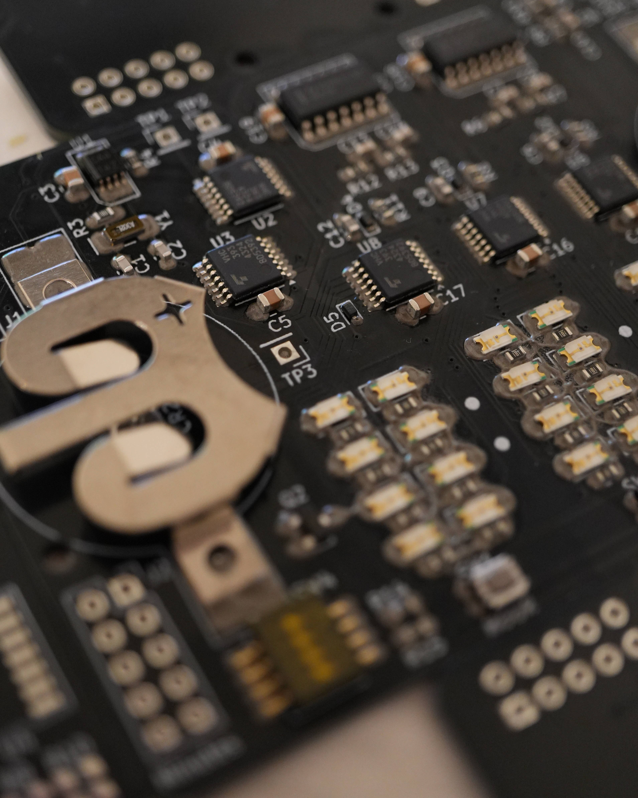

# Credit Card Clock
A fully functioning clock on a credit card sized PCB.

# Table of Contents
- [Features](#features)
- [Fixes and Updates](#fixes-and-updates)
- [Pictures](#pictures)
- [Hardware and Setup](#hardware-and-setup)
  - [Printed Circuit Board](#printed-circuit-board)
  - [Setting the Time](#setting-the-time)
- [Copyright and Licensing](#copyright-and-licensing)
- [Contact](#contact)

# Features
- On-board 2 CR2023 battery holders, one for timekeeping, one for external peripherals
- On-board switch for changing vairous clock funtions.
- Built-in binary display.
- Breakout points and mounting holes for attaching additional boards.

# Fixes and Updates
> [!IMPORTANT]
> This is currently a work in progress, things may not work at all, bear with me while I work things out!

# Pictures
<table align="center">
  <tr>
    <td align="center">
       
      <b>Mid soldering</b>
    </td>
  </tr>
</table>

# Hardware and Setup
## Printed Circuit Board
The gerber files for PCB manufacturing can be found [here](/hw/pcb/gerbers/RevA.zip).

## Setting the Time
The board has three buttons along the bottom of it (SW1, SW2, and SW3), pressing these buttons will increment the unit assocated with it.

# Copyright and Licensing
See [license](LICENSE) for in depth info.

Contact me if anything here is incorrect.

# Contact
If you'd like to get in touch, feel free to reach out!

  
  
  
  

